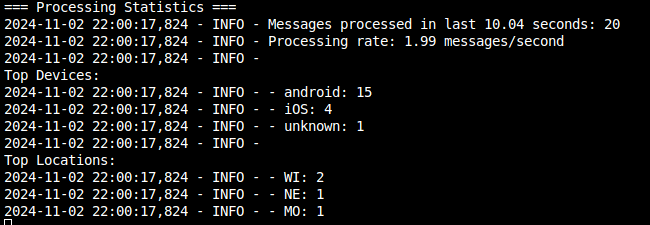

# Real-Time User Login Analytics Pipeline

## Overview
This project implements a real-time streaming data pipeline using Apache Kafka and Docker. 
The pipeline processes user login events, enriches the data, and provides real-time analytics on user behavior patterns.

## Architecture

### Components
1. **Kafka Cluster**: Single-broker Kafka cluster with Zookeeper
2. **Data Generator**: Produces synthetic user login data
3. **Stream Processor**: Python-based consumer that processes and enriches the data
4. **Output Topics**: Stores processed and enriched data (processed-logins), Stores aggregated user activity (aggregated-usage)

### Data Flow
1. **Data Generator**: Sends synthetic user login events to `user-login` Kafka topic.
   - Sample Message:
'''json
   {\"user_id\": \"424cdd21-063a-43a7-b91b-7ca1a833afae\", \"app_version\": \"2.3.0\",
\"device_type\": \"android\", \"ip\": \"199.172.111.135\", \"locale\": \"RU\", \"device_id\":
\"593-47-5928\", \"timestamp\":\"1694479551\"}
```
2. **Stream Processor**: Consumes `user-login` messages, enriches them with:
   - Readable timestamps
   - Device and app version usage statistics
   - Geographic location tracking



3. **Processed Data Storage**: Enriched messages are written to `processed-logins`:
   - Can be used for downstream graphs / aggregation requiring high resolution date-time information.

'''json
{"user_id": "2bbafdcc-5eb7-451f-b137-8229a2983a1f", 
   "app_version": "2.3.0", "ip": "198.150.109.118", 
   "locale": "MI", 
   "device_id": "0a4278a2-cb42-4daa-9887-d6b22f69be17", 
   "timestamp": 1730570189, 
   "device_type": "iOS", 
   "processed_timestamp": "2024-11-02T15:14:15.044112", 
   "readable_timestamp": "2024-11-02T13:56:29", 
   "hour_of_day": 13}
```
4. **Aggregated Metrics**: Statistics on device usage and geolocation are sent to `aggregated-usage`:
   - This data can be graphed on a time-series line plot to determine live user stats over time.

'''json
{"current_time": 1730653314.4076216, 
   "time_window": 10.02186632156372, 
   "batch_size": 1.9956362775431016, 
   "location_stats": {"ME": 1, "KS": 1, "VT": 1, "OH": 1, "LA": 1, "WV": 1, "NH": 1, "NE": 3, "CO": 1, "KY": 2, "GA": 1, "MT": 1, "MD": 1, "OK": 1, "DE": 1, "NY": 1, "AR": 1}, 
   "device_stats": {"iOS": 9, "android": 11, "unknown": 2}}
'''

## Technical Design Choices

### Fault Tolerance
- **Consumer Group**: Uses Kafka consumer groups for automatic partition rebalancing
- **Missing Data Resolution**: Converts missing fields to "unknown"
- **Auto Commit**: Enables automatic offset commits every 5 seconds
- **Error Handling**: Comprehensive error handling with logging
- **Graceful Shutdown**: Properly closes connections on shutdown

### Scalability
- **Stateless Processing**: Core processing logic is stateless, allowing horizontal scaling
- **Batch Processing**: Uses `poll()` to process messages in batches
- **Efficient Serialization**: JSON serialization for message compatibility

### Performance Optimization
- **Batch Processing**: Processes messages in batches to reduce network overhead
- **Producer Buffering**: Utilizes Kafka producer's buffering capabilities
- **Regular Flushing**: Ensures timely delivery while maintaining throughput

## Setup and Running

### Prerequisites
- Docker and Docker Compose
- Python 3.7+
- Required Python packages: `kafka-python`

### Installation
1. Start the Kafka cluster and data generator:
```bash
docker-compose up -d
```

2. Install Python dependencies:
```bash
pip install kafka-python
```
- If you run into the following error and running > Python 3.12:
```
ModuleNotFoundError: No module named 'kafka.vendor.six.moves'
```

You will need to install
```bash
pip install kafka-python-ng
```

3. Run the processor:
```bash
python kafka_consumer.py
```

### Monitoring
The processor provides real-time statistics every 10 seconds:
- Message processing rate
- Top device types
- Geographical distribution
- App version distribution

### Additional considerations:

1. Plan for deploying to production:
   - This application can be deployed on a managed Kubernetes services such as (EKS/GKE/AKD/ETC)
      - Use helm charts for deployment configuration.
      - CI/CD for auto-deploying. 
   - The Kafka consumer at "kafka-consumer.py" can be deployed using the added dockerfile onto Kubernetes.
      - I've some sample deployment configuration yaml files, ensuring the consumer pod can interact with the Kafka deployment.
      - Consumer pod is capable of horizontally autoscaling, when lag exceeds 1000 messages / second.

2. Other components that can be added for production use.
   - Grafana for usage visualizations + Prometheus for metrics collections.
   - Error monitoring: You can write out locks to either ELK stack, or cloud native tools such as CloudWatch on AWS. 
      - Performance logging via Prometheus altert manager, this can be used to notify staff if:
         - Consumer deployment is not running.
         - Slow message processing, beyond acceptably set limits, etc. 
   - Data Quality validation:
      - Implement a check to ensure messages from topics are in correct format (python type checking) / are missing key values of interest and reporting errors.
      - 
    
3. How to scale this application with growing dataset 
   - Horizontal auto-scaling via kubernetes, if messages exceed set rate. You will need to modify aggregation, to better specify the range of time it is running over, so you can capture the overlap. 
      - Balance processing across consumers effectively. 
   - Make the batch sizes for aggregation larger, currently this is batching for > 10 seconds, but this can be increased to reduce necessary latency. 
   - Dynamically make aggregation based off memory utilization. Basically if the memory of the consumer pod is greater than > x, aggregate data and send to the new consumer. 
   - Allocate more resources to the pods / cluster on Kubernetes. 
